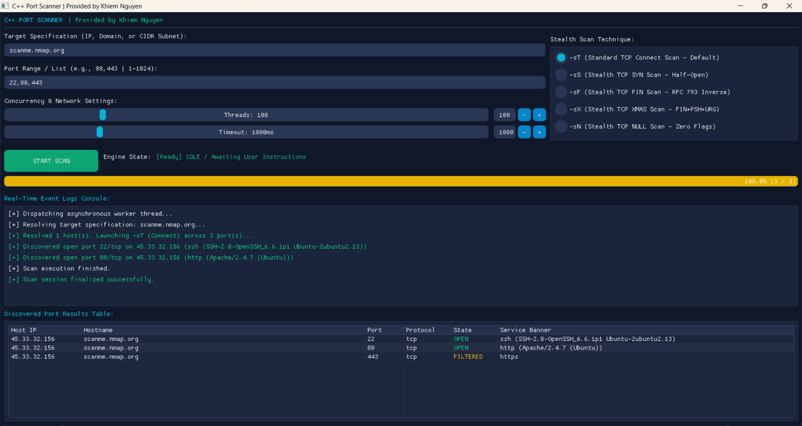
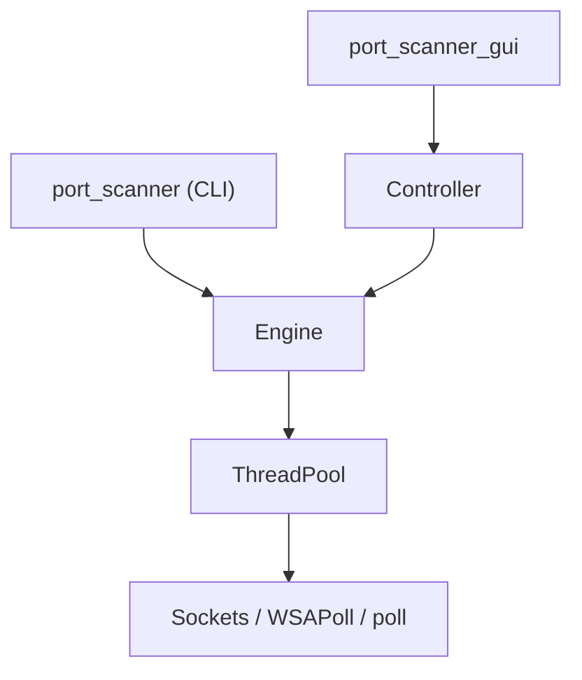

# C++ Modular Port Scanner & Dear ImGui Desktop

Modern **C++17** network port scanner featuring a reusable scanning engine, multi-threaded architecture, raw socket scanning techniques, and a Dear ImGui desktop interface.

---

## Desktop Preview



---

# Features

* Cross-platform CLI & GUI scanner (Windows & Linux)
* Native Dear ImGui desktop application (DirectX 11 & OpenGL 3)
* Modular MVC architecture
* Multi-threaded scanning engine
* Reusable thread pool
* TCP Connect scanning
* SYN / FIN / NULL / XMAS raw scans
* Protocol-aware banner grabbing
* CIDR subnet scanning
* JSON / CSV / XML report export
* Graceful scan cancellation
* WSAPoll / poll asynchronous I/O multiplexing

---

# Project Architecture

The project builds two executables that share the same scanning engine.



## MVC Design

### Model

Responsible for:

* TCP/UDP scanning
* Raw socket packet construction
* Banner grabbing
* Export pipeline
* Thread pool scheduling

Location:

```text
src/scanner_engine.cpp
```

---

### Controller

Responsible for:

* Launching scan workers
* Progress updates
* Scan cancellation
* Thread synchronization

Location:

```text
src/scan_controller.cpp
```

---

### View

Responsible for:

* Dear ImGui rendering
* Interactive scan configuration
* Live console
* Result tables
* Responsive layouts

Location:

```text
src/gui_view.cpp
```

---

# Supported Features

| Feature          | CLI | GUI |
| ---------------- | --- | --- |
| Windows          | ✅   | ✅   |
| Linux            | ✅   | ✅   |
| TCP Connect Scan | ✅   | ✅   |
| SYN Scan         | ✅   | ✅   |
| FIN Scan         | ✅   | ✅   |
| NULL Scan        | ✅   | ✅   |
| XMAS Scan        | ✅   | ✅   |
| Banner Grabbing  | ✅   | ✅   |
| CIDR Scan        | ✅   | ✅   |
| JSON Export      | ✅   | ✅   |
| CSV Export       | ✅   | ✅   |
| XML Export       | ✅   | ✅   |

---

# Engineering Notes

### Responsive Desktop UI

Scanning is executed entirely on background worker threads, allowing the GUI to remain responsive throughout long-running scans.

### Efficient Synchronization

The scanning engine minimizes mutex contention by combining atomic counters with preallocated storage for scan results.

### Graceful Shutdown

Closing the application during an active scan signals cancellation tokens, waits for worker threads to finish, and releases resources safely.

### Cross-Platform Networking

Networking is abstracted behind a common interface using Winsock on Windows and POSIX sockets on Linux.

---

# Building

## Windows

Requirements

* Visual Studio 2019 or newer
* Desktop Development with C++
* CMake

```powershell
cmake -B build -S .

cmake --build build --config Release
```

Generated binaries

```text
build/
├── port_scanner.exe
└── port_scanner_gui.exe
```

---

## Linux

Install dependencies

```bash
sudo apt update

sudo apt install build-essential cmake git libsdl2-dev libgl1-mesa-dev
```

Build

```bash
cmake -B build -S .

cmake --build build -j$(nproc)
```

> **Note for WSL users working on Windows mounted drives (`/mnt/c`, `/mnt/d`):** To avoid NTFS file permission errors, specify a build path inside the Linux filesystem instead: `cmake -B ~/build_scanner -S .`

Generated binaries

```text
build/
├── port_scanner
└── port_scanner_gui
```

---

# Usage

## Launch GUI

### Windows
```powershell
.\build\port_scanner_gui.exe
```

### Linux
```bash
./build/port_scanner_gui
```

Steps

1. Enter an IP address, hostname, or CIDR range.
2. Specify target ports.
3. Select the scan method.
4. Configure thread count.
5. Start the scan.

---

## CLI Examples

TCP Connect Scan

```bash
./build/port_scanner \
-t scanme.nmap.org \
-p 22,80,443 \
-o result.json
```

Subnet Scan

```bash
./build/port_scanner \
-t 192.168.1.0/24 \
-p 80 \
--threads 200 \
--timeout 500
```

Linux SYN Scan

```bash
sudo ./build/port_scanner \
-t 10.0.0.1 \
-p 1-1024 \
-sS \
-o report.csv
```

---

# Project Structure

```text
.
├── assets/
├── include/
├── src/
│   ├── scanner_engine.cpp
│   ├── scan_controller.cpp
│   ├── gui_view.cpp
│   └── ...
├── third_party/
├── CMakeLists.txt
└── README.md
```

---

# Technical Limitations

## Windows Raw Socket Restrictions

Windows restricts custom TCP packet transmission through raw sockets. True SYN/FIN/NULL/XMAS scans require Npcap. Otherwise, the scanner automatically falls back to TCP Connect mode.

---

## RFC 793 Compatibility

FIN, NULL and XMAS scans rely on RFC 793 behavior. Some operating systems—especially Windows—do not fully implement this behavior, reducing the reliability of these scan techniques.

---

# License

This project is licensed under the MIT License.

---

# Author

**Khiem Nguyen**
